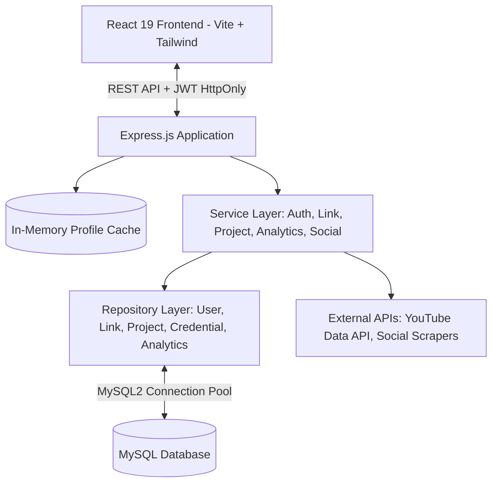

# LinkHub — Professional Identity & Portfolio Orchestration Platform

LinkHub is a high-performance, conversion-focused professional identity and portfolio orchestration platform. Engineered specifically for high-performing freelancers, engineers, and creative digital professionals—including distributed talent navigating global and local ecosystems (such as Ethiopian tech freelancers integrating Telegram, GitHub, Upwork, and portfolio showcase)—LinkHub transforms the traditional "link list" into an authoritative, client-converting digital identity.

---

## 💎 The Value Proposition: Beyond Simple Link Lists

Traditional link-in-bio tools treat your life's work as a stack of plain text buttons. LinkHub is designed around three pillars that turn profile visitors into paying clients and collaborators:

1. **High-Conversion Primary Action (CTA)**: A dedicated, unmistakable conversion driver pinned right beneath your bio (e.g. *"Book Discovery Call"*, *"Hire Me on Upwork"*, *"Start Telegram Chat"*, or *"Download Technical CV"*).
2. **Featured Projects & Work Showcase**: Interactive visual project cards displaying live deliverables, roles, tech stacks, and live demo links.
3. **Verified Credentials & Proof**: Showcase degrees, certificates, and academic credentials alongside verified social proof (live YouTube subscriber metrics, GitHub repository statistics, and Telegram channels).

---

## ✨ Features & Capabilities

### 1. 🎛️ Creator Command Center & Dashboard
- **Dual-Pane Studio**: Real-time control panel paired with a live, interactive Obsidian-themed canvas preview.
- **Project Portfolio Manager**: Add, edit, feature, and drag-and-drop reorder project cards complete with tech badges and demo URLs.
- **Credentials & Proof Matrix**: Manage verified credentials, issuing institutions, and award years.
- **Identity Studio**: Instant sync for display names, `@username`, rich bios, custom avatars, and atmospheric banner artwork.
- **Design Token Engine**: Obsidian & Lime aesthetic with bespoke typography pairing (**Manrope** headings + **IBM Plex Mono** telemetry labels) and customizable accent colors.
- **Account & Security Settings**: Manage credentials, update email, change password with cryptographic validation, or request irreversible account deletion with verification safeguards.

### 2. 🔗 Link Management & Smart Display Modes
- **Three Display Modes**: Render items as standard links, accent header pills, or rich platform cards.
- **Platform Auto-Detection**: Identifies 20+ services (GitHub, Telegram, Upwork, LinkedIn, YouTube, Instagram, X/Twitter, etc.) and auto-attaches branding icons and metadata.
- **Drag-and-Drop Reordering**: Smooth, responsive reordering backed by atomic database transactions.
- **Automated Scheduling**: Schedule links with ISO datetime timestamps that automatically appear only when active.
- **Quota & URL Enforcement**: Strict HTTP/HTTPS validation rejecting unsafe pseudo-protocols (`javascript:`, `data:`, `vbscript:`) and configurable link limits.

### 3. 🌐 Social Integrations & Aggregated Proof
- **Multi-Platform Integration**: Direct connection with YouTube, GitHub, Telegram, Instagram, Twitter/X, LinkedIn, and TikTok.
- **Real-Time Follower & Repo Sync**: Automatic scraping and live API verification of follower counts and repository statistics.
- **Aggregate Audience Metric**: Aggregates verified reach across platforms and displays an audience proof badge on the public profile.

### 4. 📈 Conversion Analytics & Channel Attribution
- **Multi-Channel Engagement Tracking**: Separates and attributes clicks between **Standard Links**, **Primary CTA**, and **Showcase Projects**.
- **Effective CTR Calculation**: Real-time conversion tracking calculating `Effective CTR = (Total Outbound Engagement / Unique Views) * 100`.
- **Engagement Channel Progress Bar**: Visual breakdown showing where audience attention converts.
- **Deduplication Engine**: Rolling 5-minute sliding window eliminates accidental or double-tap spam.
- **GDPR-Friendly IP Anonymization**: IP addresses are salted with SHA-256 before storage.
- **Device & Platform Analytics**: Real-time device breakdown (Desktop, Tablet, Mobile) and 30-day timeline charts.

### 5. 🛡️ Hardened Security & Production Readiness
- **In-Memory Profile Caching (`MemoryCache`)**: Sub-millisecond profile reads with instant cache invalidation on any user or link mutation.
- **Magic Byte Image Inspection**: Server-side binary inspection of file signatures (JPEG, PNG, WebP, GIF) prevents MIME-spoofing and stored payload injection.
- **Cross-User Tenant Isolation**: Strict database-level authorization preventing cross-account modifications.
- **Security Headers Audit**: Comprehensive Helmet configuration enforcing strict Content Security Policy (CSP), Frameguard (anti-clickjacking), and Referrer-Policy.
- **Health Endpoints**:
  - `GET /health`: Liveness probe reporting process uptime.
  - `GET /health/ready`: Readiness probe actively verifying database connectivity.
- **Graceful Shutdown**: Intercepts `SIGTERM` and `SIGINT` signals, drains HTTP connections, cleanly disconnects the MySQL connection pool, and enforces a 10-second termination timeout.

---

## 🏗️ Architecture Overview

LinkHub follows a clean, decoupled architecture:



### Key Modules:
- **`Backend/src/controllers/`**: HTTP request handlers and input normalization.
- **`Backend/src/services/`**: Business logic, conversion metrics calculation, social fetching, and cache invalidation.
- **`Backend/src/repositories/`**: Clean SQL queries with parameterized statements and transactions.
- **`Backend/src/validators/`**: Zod schema validators enforcing strict payload shapes and protocol limits.
- **`Backend/src/utils/cache.js`**: In-memory caching with reverse user index for instant cache clearance.
- **`Backend/src/utils/imageValidator.js`**: File signature / magic byte binary validator.

---

## 🔌 API Reference

### Health & Operations
| Method | Endpoint | Access | Description |
|:---|:---|:---|:---|
| `GET` | `/health` | Public | Liveness probe returning server status and uptime |
| `GET` | `/health/ready` | Public | Readiness probe checking MySQL database pool |

### Authentication & Account
| Method | Endpoint | Access | Description |
|:---|:---|:---|:---|
| `POST` | `/api/auth/register` | Public | Register new client account |
| `POST` | `/api/auth/login` | Public | Authenticate user and issue secure JWT cookie |
| `POST` | `/api/auth/logout` | Authenticated | Clear authentication session |
| `POST` | `/api/auth/forgot-password` | Public | Request secure password reset token |
| `POST` | `/api/auth/reset-password` | Public | Reset account password with token |
| `GET` | `/api/users/me` | Authenticated | Retrieve current authenticated user profile |
| `PUT` | `/api/users/profile-details` | Authenticated | Update bio, display name, and visibility toggles |
| `PUT` | `/api/users/avatar` | Authenticated | Upload and validate avatar image |
| `DELETE` | `/api/users/avatar` | Authenticated | Remove custom avatar |
| `PUT` | `/api/users/banner` | Authenticated | Upload and validate banner image |
| `PUT` | `/api/users/password` | Authenticated | Change account password |
| `PUT` | `/api/users/email` | Authenticated | Change account email |
| `DELETE` | `/api/users/account` | Authenticated | Irreversibly delete account and cascade dependencies |

### Link Management
| Method | Endpoint | Access | Description |
|:---|:---|:---|:---|
| `GET` | `/api/mylinks` | Authenticated | List all links owned by current user |
| `POST` | `/api/mylinks` | Authenticated | Create link (validates protocol and enforces quota) |
| `PUT` | `/api/mylinks/order` | Authenticated | Transactionally reorder links |
| `PUT` | `/api/mylinks/:linkId` | Authenticated | Update link title, URL, icon, and display mode |
| `PUT` | `/api/mylinks/:linkId/visibility` | Authenticated | Toggle link visibility on public profile |
| `DELETE` | `/api/mylinks/:linkId` | Authenticated | Delete link and associated telemetry |

### Portfolio Projects & Credentials
| Method | Endpoint | Access | Description |
|:---|:---|:---|:---|
| `GET` | `/api/projects` | Authenticated | List showcase projects |
| `POST` | `/api/projects` | Authenticated | Create new showcase project |
| `PUT` | `/api/projects/:id` | Authenticated | Update showcase project |
| `DELETE` | `/api/projects/:id` | Authenticated | Delete showcase project |
| `PUT` | `/api/projects/reorder` | Authenticated | Reorder showcase projects |
| `GET` | `/api/credentials` | Authenticated | List verified credentials |
| `POST` | `/api/credentials` | Authenticated | Create verified credential |
| `PUT` | `/api/credentials/:id` | Authenticated | Update verified credential |
| `DELETE` | `/api/credentials/:id` | Authenticated | Delete verified credential |

### Analytics & Conversion Telemetry
| Method | Endpoint | Access | Description |
|:---|:---|:---|:---|
| `GET` | `/api/analytics` | Authenticated | Retrieve summary, daily timeline, and channel breakdown |
| `POST` | `/api/analytics/click/:linkId` | Public | Record standard link click event |
| `POST` | `/api/analytics/view/:username` | Public | Record public profile view event |
| `POST` | `/api/analytics/cta/:username` | Public | Record primary CTA conversion click |
| `POST` | `/api/analytics/project/:projectId` | Public | Record portfolio project card click |

### Public Profiles
| Method | Endpoint | Access | Description |
|:---|:---|:---|:---|
| `GET` | `/api/profile/:username` | Public | Cached public profile data with projects and credentials |
| `GET` | `/api/profile/check/:username` | Public | Verify username availability |
| `PUT` | `/api/profile/username` | Authenticated | Claim or update username |
| `PUT` | `/api/profile` | Authenticated | Update theme, primary CTA, and colors |

---

## 🚀 Getting Started

### Prerequisites
- **Node.js**: v18.0.0 or higher
- **MySQL Server**: v8.0 or higher / MariaDB 10.5+

---

### 1. Database Setup & Migrations

Create your MySQL database:
```sql
CREATE DATABASE linkhub CHARACTER SET utf8mb4 COLLATE utf8mb4_unicode_ci;
```

Run database migrations:
```bash
cd Backend
npm run migrate
```
This executes sequential, idempotent migrations:
1. `001_initial_schema.sql` (clients, links, clicks, profile_views, integrations)
2. `002_integrity_constraints.sql` (foreign keys, check constraints)
3. `003_daily_analytics_aggregates.sql` (daily metrics table)
4. `004_projects_credentials_cta.sql` (projects, credentials, and primary CTA columns)

---

### 2. Backend Configuration & Startup

```bash
cd Backend
cp .env.example .env
# Edit .env with your MySQL credentials and JWT_SECRET
npm install
npm run dev
```

The backend starts at `http://localhost:3002`.

---

### 3. Frontend Configuration & Startup

```bash
cd link-sharing-frontend
npm install
npm run dev
```

The frontend will run at `http://localhost:5173`.

---

## 🧪 Running Automated Tests

LinkHub features comprehensive decoupled unit and integration test suites built on Node's native test runner (`node:test`):

```bash
cd Backend
npm test
```

### Test Coverage Includes:
- **Authorization Suite** (`authorization.test.js`): Cross-user tenant isolation on links and projects.
- **Validation Suite** (`validation.test.js`): XSS attack vectors, pseudo-protocol rejection (`javascript:`), payload limits, and email format rules.
- **Projects & Credentials** (`projects.test.js`, `credentials.test.js`): Payload validation and boundary conditions.
- **Cache Suite** (`cache.test.js`): In-memory TTL expiration, reverse user index invalidation, and case-insensitivity.
- **Image Validator** (`imageValidator.test.js`): Magic byte verification for PNG, JPEG, WebP, and rejection of spoofed scripts.
- **Analytics & Social** (`analyticsService.test.js`, `socialProvider.test.js`): CTR formulas, device classification, and provider responses.
- **Security & Error Handling** (`errors.test.js`, `logger.test.js`, `reservedUsernames.test.js`).

---

## 🔒 Security Best Practices

- **Zero-Secret Commits**: All sensitive keys are excluded via `.gitignore`.
- **Cryptographic Magic Byte Verification**: Uploads are verified by file signature on disk, preventing MIME-type header spoofing.
- **Strict Content Security Policy**: Denies unauthorized frame embedding (clickjacking defense) and limits script execution.
- **Anonymized Telemetry**: Visitor IP addresses are salted and hashed with SHA-256 before persistence.
- **SQL Prepared Statements**: Parameterized queries across all repository layers eliminate SQL injection risks.

---

## 📄 License
MIT License. Built for creators and developers who value precision, performance, and professional identity.