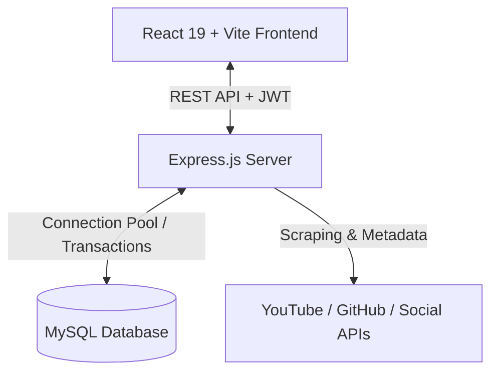

# LinkHub — Modern Creator Identity & Link Orchestration Platform

LinkHub is a high-performance, full-stack link-in-bio and digital identity orchestration platform built for creators, developers, and brands. It pairs an atmospheric, dark-mode dashboard with real-time interactive canvas previews, comprehensive click & view analytics, and automated social media profile aggregation.

---

## ✨ Features

### 1. 🎛️ Creator Command Center & Dashboard
- **Dual-Pane Layout**: Unified control panel alongside a live, interactive mobile canvas preview.
- **Overview Dashboard**: High-level conversion metrics, top destination indicators, and live activity pulses.
- **Profile Identity Studio**: Update display name, custom `@username`, rich bio, avatar, and banner imagery with instant live sync.
- **Design & Theme Engine**: Apply custom color schemes and aesthetic presets (`Dark Pro`, `Neon Glow`, `Minimal Light`, `Creator Mode`).
- **Account Settings**: Update verified email, change password with strength validation, or request irreversible account deletion with verification safeguards.

### 2. 🔗 Link Management & Network Matrix
- **Drag-and-Drop Reordering**: Smooth list reordering powered by `react-dnd` and saved with atomic MySQL transactions.
- **Inline Editing**: Instant inline title and URL modification without full modal context switching.
- **Visibility Toggle**: Hide or unhide individual links on public profiles on demand (`is_visible`).
- **Validation & Quota Enforcement**: Strict HTTP/HTTPS schema validation and configurable per-user link quotas (`MAX_LINKS_PER_USER`).
- **Platform Auto-Detection**: Automatically identifies targets (GitHub, Twitter, YouTube, Instagram, etc.) and attaches appropriate branding icons.

### 3. 🌐 Social Aggregator & Verified Proof
- **Multi-Platform Integration**: Connect handles for YouTube, GitHub, Instagram, Twitter / X, Telegram, LinkedIn, and TikTok.
- **Dynamic Profile Scraping**: Backend scrapers extract live follower counts, subscriber metrics, and public repository counts.
- **Public Proof Badges**: Display verified counters and direct outbound shortcuts on the public profile.

### 4. 📈 Deep Analytics & Audience Intelligence
- **Profile View & Click Tracking**: Track incoming visitors and outgoing link clicks with granular timestamps and referrer headers.
- **Deduplication Engine**: Built-in 5-minute rolling window prevents click and view inflation from accidental or repeated taps.
- **Privacy First (GDPR-Friendly)**: IP addresses are salted and hashed using SHA-256 before persistence.
- **Device & Platform Analytics**: Classifies traffic between Desktop, Tablet (iPad), and Mobile devices.
- **Interactive Visualizations**: 30-day timeline charts and device distribution graphs rendered using Chart.js.

### 5. 🛡️ Security & Authentication Hardening
- **JWT Session Management**: Tokens configured with explicit expiration and verified client-side via payload decode.
- **Global Axios Interceptor**: Automatically detects `401 Unauthorized` or `403 Forbidden` responses, gracefully flushing local sessions and redirecting to login.
- **Onboarding Guard**: Prevents users from accessing the dashboard with unset usernames, guiding them through a streamlined setup flow.
- **Password Strength Standards**: Enforces minimum 8 characters, at least one uppercase letter, and at least one numeric character.
- **Secure Password Reset Flow**: `POST /forgot-password` and `POST /reset-password` endpoints generate one-way hashed 1-hour expiration tokens with constant-time response behavior to eliminate account enumeration vectors.
- **Input Sanitization**: Reusable validation middleware eliminates raw SQL error exposure.

---

## 🏗️ Architecture & Tech Stack



### Frontend
- **Framework**: React 19 (Vite)
- **Styling**: TailwindCSS & Custom CSS Variables (Design Tokens)
- **Animations**: Framer Motion
- **Drag & Drop**: React DnD with HTML5 Backend
- **Data Visualization**: Chart.js & React-Chartjs-2
- **Icons**: Lucide React & React Icons
- **Notifications**: React Hot Toast
- **Routing**: React Router v7

### Backend
- **Runtime**: Node.js (ES Modules)
- **Framework**: Express.js
- **Database**: MySQL2 (with Promise pool & transaction isolation)
- **Authentication**: JSON Web Tokens (`jsonwebtoken`) & `bcrypt`
- **Scraping & DOM Parsing**: JSDOM & Axios
- **Rate Limiting**: `express-rate-limit`

---

## 🗄️ Database Schema

The database automatically self-migrates on startup through idempotent column and table definitions in `db.js`.

- **`clients`**: User accounts, credentials, profile bio, avatar, banner, theme, social handles, and password reset tokens.
- **`links`**: User links with title, URL, platform, username, avatar, icon, ordering `position`, `is_visible`, and scheduling.
- **`clicks`**: Link click telemetry containing `link_id`, `user_id`, `ip` (SHA-256 hash), `device`, `referrer`, and `timestamp`.
- **`profile_views`**: Public profile views telemetry containing `user_id`, `ip` (SHA-256 hash), `device`, `referrer`, and `timestamp`.

---

## 🔌 API Reference

### Authentication & Account
| Method | Endpoint | Access | Description |
|:---|:---|:---|:---|
| `POST` | `/register` | Public | Register new user with password strength validation |
| `POST` | `/login` | Public | Authenticate user and receive JWT |
| `POST` | `/forgot-password` | Public | Request 1-hour password reset token via email |
| `POST` | `/reset-password` | Public | Reset password using valid reset token |
| `GET` | `/api/users/me` | Authenticated | Retrieve current user profile and credentials |
| `PUT` | `/api/users/password` | Authenticated | Change account password (verifies current password) |
| `PUT` | `/api/users/email` | Authenticated | Change account email (verifies current password) |
| `DELETE` | `/api/users/account` | Authenticated | Delete account and cascade delete all links/analytics |

### Links Management
| Method | Endpoint | Access | Description |
|:---|:---|:---|:---|
| `GET` | `/api/mylinks` | Authenticated | Retrieve ordered list of user's links |
| `POST` | `/api/mylinks` | Authenticated | Create a new link (validates URL & enforces quota) |
| `PUT` | `/api/mylinks/order` | Authenticated | Reorder links transactionally (`{ order: [id, ...] }`) |
| `PUT` | `/api/mylinks/:linkId` | Authenticated | Update link title, URL, and metadata |
| `PUT` | `/api/mylinks/:linkId/visibility` | Authenticated | Toggle link visibility on public profile |
| `DELETE` | `/api/mylinks/:linkId` | Authenticated | Delete link and associated telemetry |

### Profile & Socials
| Method | Endpoint | Access | Description |
|:---|:---|:---|:---|
| `GET` | `/api/profile/:username` | Public | Retrieve public profile data, links, and socials |
| `GET` | `/api/profile/check/:username` | Public | Check if username is available |
| `PUT` | `/api/profile` | Authenticated | Update full name, username, bio, and theme |
| `PUT` | `/api/profile/username` | Authenticated | Set initial username during onboarding |
| `PUT` | `/api/users/social-profiles` | Authenticated | Save connected social platform handles |
| `POST` | `/api/profile/avatar` | Authenticated | Upload custom avatar image |
| `POST` | `/api/profile/banner` | Authenticated | Upload custom profile banner image |

### Analytics & Tracking
| Method | Endpoint | Access | Description |
|:---|:---|:---|:---|
| `POST` | `/api/analytics/click/:linkId` | Public | Track link click (with IP hashing & deduplication) |
| `POST` | `/api/analytics/view/:username` | Public | Track profile page view (with deduplication) |
| `GET` | `/api/analytics` | Authenticated | Get total clicks, views, daily breakdown, and device stats |

---

## 🚀 Getting Started

### Prerequisites
- **Node.js**: v18.0.0 or higher
- **MySQL Server**: v8.0 or MariaDB v10.5+ running locally or remotely

---

### 1. Backend Setup

```bash
cd Linkhub/Backend
npm install
```

Create a `.env` file in `Linkhub/Backend/`:
```env
PORT=3002
FRONTEND_URL=http://localhost:5173

# Database configuration
DB_HOST=localhost
DB_USER=root
DB_PASSWORD=your_mysql_password
DB_NAME=clientinfo

# Security & Secrets
JWT_SECRET=your_super_secret_random_key
JWT_EXPIRES_IN=7d
IP_SALT=custom_salt_for_ip_hashing_compliance
MAX_LINKS_PER_USER=50

# Optional Social API Credentials
YOUTUBE_API_KEY=your_youtube_data_api_v3_key
TELEGRAM_BOT_TOKEN=your_telegram_bot_token
```

Start the backend server:
```bash
npm start
# or for auto-reload during development:
npm run dev
```

The database tables (`clients`, `links`, `clicks`, `profile_views`) will automatically be bootstrapped and verified on startup.

---

### 2. Frontend Setup

```bash
cd Linkhub/link-sharing-frontend
npm install
```

Create an `.env` file in `Linkhub/link-sharing-frontend/`:
```env
VITE_API_BASE_URL=http://localhost:3002
```

Start the Vite development server:
```bash
npm run dev
```

Open [http://localhost:5173](http://localhost:5173) in your browser.

---

### 3. Production Build

To build the client bundle for production:
```bash
cd Linkhub/link-sharing-frontend
npm run build
```
Production assets will be output to `link-sharing-frontend/dist/`.

---

## 🔒 Security Best Practices
- **Never commit `.env`**: Environment configuration files are added to `.gitignore`.
- **Hashed IP addresses**: No raw visitor IP addresses are stored in the analytics tables.
- **Prepared statements**: All database operations use parameter binding to safeguard against SQL injection.
- **Transaction guarantees**: Concurrent reorder operations run inside transactions to prevent index corruption.

---

## 📄 License
This project is licensed under the MIT License.